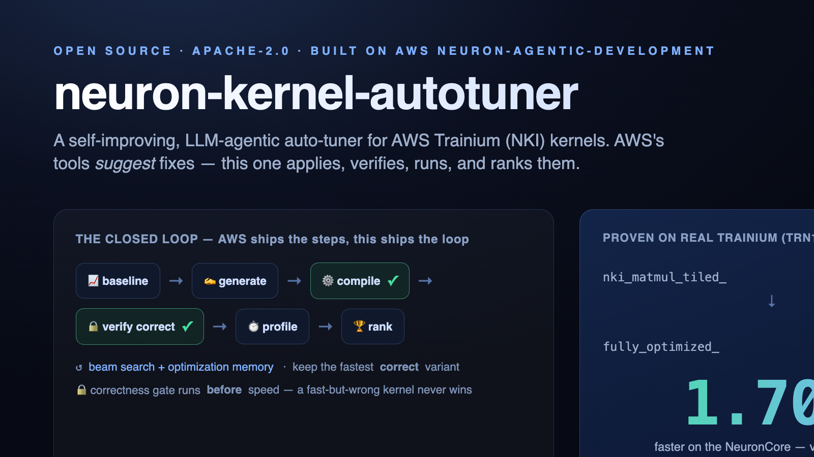
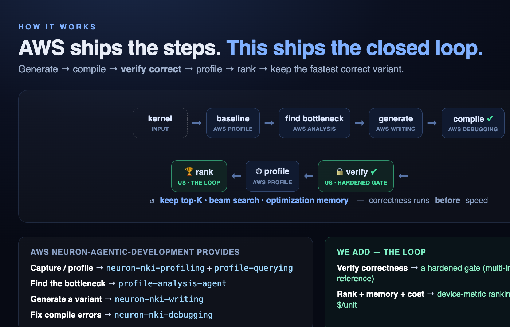

# neuron-kernel-autotuner

**A self-improving, LLM-agentic auto-tuner for AWS Neuron (NKI) kernels — built on top of AWS's [neuron-agentic-development](https://github.com/aws-neuron/neuron-agentic-development).**

AWS's tools *suggest* optimizations. This *applies, verifies, runs, and ranks* them — and keeps the fastest variant that is provably still correct.



**Hardware:** runs on **AWS Neuron — Trainium (`trn1`/`trn2`) and Inferentia (`inf2`)** — anything that runs NKI on NeuronCores. Validated on Trainium (`trn1.2xlarge`, NeuronCore-v2); `inf2` is the same NeuronCore-v2 and is supported but not yet separately validated.

> Status: v0. The pure logic is built and unit-tested; the first end-to-end proof runs the vendored matmul example on a real Neuron instance. See [Proof](#proof-matmul-on-trainium).

---

## The gap this fills

| | Capture | Single-profile analysis | Suggest fixes | **Generate + run + rank variants** | Cost ($) | CI gate |
|---|:--:|:--:|:--:|:--:|:--:|:--:|
| Neuron Explorer (GUI, Claude-powered) | ✅ | ✅ | ✅ | ❌ | ❌ | ❌ |
| AWS `neuron-agentic-development` (skills) | ✅ | ✅ | ✅ | ❌ | ❌ | ❌ |
| **neuron-kernel-autotuner** | reuse | reuse | reuse | ✅ | ✅ | (roadmap) |

Every Neuron tool — including AWS's Claude-Sonnet-4.5-powered Neuron Explorer — stops at *"you should try X."* Nobody closes the loop: generate the variant, compile it, **prove it's numerically correct**, profile it on real silicon, and rank it by actual speedup and % of peak. That loop is this project.

## How it works



We **compose** AWS's agentic-dev skills as the building blocks and add the parts they don't have:

| Loop step | AWS provides | We add |
|---|---|---|
| Capture / measure | `neuron-nki-profiling`, `neuron-nki-profile-querying` | normalize → `profile.json` |
| Find the bottleneck | `neuron-nki-profile-analysis-agent` | use as variant **seed** |
| Generate variant | `neuron-nki-writing` | **beam search** from top-K |
| Compile + fix | `neuronx-cc` + `neuron-nki-debugging` | bounded retry |
| Correctness gate | (kernel-level `torch.allclose`) | **hardened** multi-input, anti-reward-hack |
| Diff + rank | single before/after | **cross-variant ranking + % of peak** |
| Self-improve | — | **optimization memory** + early-stop |
| Cost | — | **$/1M-units** |

Full mapping and orchestrator pseudocode: [`docs/ORCHESTRATION.md`](docs/ORCHESTRATION.md).

## Proof: matmul on Trainium

The first end-to-end run uses a **known-good pair** from [aws-neuron/nki-samples](https://github.com/aws-neuron/nki-samples) (vendored under [`examples/matmul/`](examples/matmul/), MIT-0) so we validate the measure→verify→diff chain before trusting generated variants:

- **baseline:** `nki_matmul_tiled_` — arithmetic intensity ~102, memory-bound
- **"variant 2":** `nki_matmul_fully_optimized_` — arithmetic intensity ~683, compute-bound
- 4096×1024 · 1024×2048, bf16, on `trn1.2xlarge` (NeuronCore-v2)

The tutorial proves these are *correct*; this tool proves the optimized one is *faster*, with numbers:

<!-- RESULTS:START -->
Measured on **trn1.2xlarge (NeuronCore-v2), us-west-2, Neuron SDK 2.25**. Device latency via `neuron-bench` (median of 300 iters); correctness via `torch.allclose(atol=1e-4, rtol=1e-2)` over 3 randomized input sets. Raw artifacts in [`results/`](results/).

| variant | device latency (µs) | DMA-active | verified |
|---|--:|--:|:--:|
| `nki_matmul_tiled_` (baseline) | **463** | 16.0% | ✅ |
| `nki_matmul_fully_optimized_` | **273** | 7.5% | ✅ |
| **speedup** | **1.70×** | (less memory-bound) | |

The optimized kernel is **1.70× faster on the NeuronCore**, and the profile shows *why*: DMA-active time drops from 16.0% to 7.5% — it's markedly less memory-bound, exactly what the arithmetic-intensity jump (102→683) predicts.

> **Methodology note (and the project's thesis in one finding):** end-to-end *framework* wall-clock (torch_xla) measured ~57 ms for **both** kernels — dispatch/transfer overhead swamped the kernel and hid the difference entirely (apparent speedup 1.00×). Only **device-level** measurement (`neuron-bench` / `neuron-explorer`) surfaced the real 1.70×. An autotuner must rank on device metrics, not wall-clock. This is why the loop is built around the profile.
<!-- RESULTS:END -->

Walkthrough: [`docs/HOWTO-matmul-e2e.md`](docs/HOWTO-matmul-e2e.md).

## Usage

There are three ways to use this, from zero-hardware to full loop.

### 1. Run the pure logic locally (no hardware)

The parse/verify/diff/cost modules need no Neuron device:

```bash
pip install -e ".[dev]"
pytest -q                  # 12 tests, incl. the anti-reward-hack correctness cases
```

```python
from nka.diff import rank          # rank verified variants by speedup + % of peak
from nka.verify import verify_outputs   # hardened correctness gate
from nka.parse import parse_summary     # neuron-explorer summary-json -> profile.json
from nka.cost import cost_of            # $/1M-units
```

### 2. Reproduce the matmul proof on your own Neuron box

This is exactly how the 1.70× result below was produced. Works on any Neuron instance (`trn1`/`trn2`/`inf2`); we used `trn1.2xlarge`.

```bash
# (a) launch a Neuron box — trn1.2xlarge is plenty (NeuronCore-v2; inf2 works too), Neuron DLAMI
#     e.g. AMI "Deep Learning AMI Neuron PyTorch 2.9 (Ubuntu 24.04)", us-west-2

# (b) copy this repo to the instance and SSH in
scp -r . ubuntu@<instance-ip>:~/neuron-kernel-autotuner
ssh ubuntu@<instance-ip>

# (c) on the instance: one command does correctness + device speedup + artifacts
cd ~/neuron-kernel-autotuner
bash scripts/bootstrap_trn1.sh
#   -> activates the Neuron venv
#   -> run_e2e.py        : verifies both kernels vs torch over 3 input sets
#   -> bench_matmul.sh   : neuron-bench device latency for both -> speedup
#   -> _build_profiles.py: parse summary-json -> results/profile_*.json + diff.json
```

Result lands in [`results/`](results/): `measured.json`, `diff.json`, and a
`profile_*.json` per variant. You should see `nki_matmul_tiled_` ≈ 463 µs and
`nki_matmul_fully_optimized_` ≈ 273 µs (≈ 1.70×).

What each script does:
| script | purpose | needs hardware |
|---|---|---|
| `scripts/run_e2e.py` | run + verify correctness of both variants | yes |
| `scripts/bench_matmul.sh` | device latency via `neuron-bench` → speedup | yes |
| `scripts/_build_profiles.py` | parse summary-json → `profile.json` + diff | no (post-process) |

### 3. As a Claude Code skill (the full loop)

The orchestrator ships as a Claude Code skill — [`skill/SKILL.md`](skill/SKILL.md) — so you can run `/neuron-kernel-autotune <kernel>` from Claude Code **on the Neuron instance** and have it drive the whole loop.

**Prerequisites (all on the trn/inf2 box):**
```bash
# 1. AWS's agentic-dev skills (we compose these), deployed to Claude Code
pip install neuron-agentic-development --extra-index-url https://pip.repos.neuron.amazonaws.com
deploy-neuron-agentic-development-to-claude

# 2. this project (so the nka.* helper modules import)
git clone https://github.com/lior-mechlovich/neuron-kernel-autotuner.git
cd neuron-kernel-autotuner && pip install -e .
```

**Install the skill** into Claude Code (personal skills dir, or `.claude/skills/` for a project):
```bash
mkdir -p ~/.claude/skills/neuron-kernel-autotune
cp skill/SKILL.md ~/.claude/skills/neuron-kernel-autotune/
# (project-local alternative: cp skill/SKILL.md .claude/skills/neuron-kernel-autotune/)
```

**Use it** — from Claude Code on the instance:
```
/neuron-kernel-autotune path/to/your_kernel.py
```
or just ask: *"optimize this NKI kernel and prove the speedup."* The skill profiles a baseline, finds the bottleneck (AWS `profile-analysis-agent`), generates variants (AWS `neuron-nki-writing`), fixes compile errors (AWS `neuron-nki-debugging`), runs the **hardened correctness gate** (`nka.verify`), profiles each on device, and **ranks** by speedup + % of peak (`nka.diff`) — keeping only the fastest *correct* variant.

> **Status:** the measure → verify → diff spine is proven (the 1.70× matmul result above). Autonomous multi-variant generation/ranking inside the skill is [v1](https://github.com/lior-mechlovich/neuron-kernel-autotuner/issues/1). Today the skill is best used to profile + verify + diff a kernel and its hand-written variants; full auto-generation lands in v1.

See [`skill/SKILL.md`](skill/SKILL.md) for the exact step ordering and [`docs/HOWTO-matmul-e2e.md`](docs/HOWTO-matmul-e2e.md) for a worked run.

## Why a hardened correctness gate

[AccelOpt](https://arxiv.org/abs/2511.15915) (the closest prior research) found that an LLM *will game a weak correctness checker by computing partial results* and report a fake speedup. So our [`nka/verify.py`](nka/verify.py) requires multiple randomized input sets, full-output comparison, and a hidden reference. **A faster-but-wrong kernel is never reported as a winner.**

## Roadmap

- **v0** — prove the loop on the matmul pair *(this release)*
- **v1** — LLM variant generation + beam search + ranking across N variants
- **v2** — optimization memory (slow→fast reuse) + cost framing
- **v3** — CI regression gate (headless CLI + GitHub Action over the same engine)

## Credits & prior art

- Built on AWS [neuron-agentic-development](https://github.com/aws-neuron/neuron-agentic-development) (Apache-2.0).
- Test case from AWS [nki-samples](https://github.com/aws-neuron/nki-samples) (MIT-0).
- Inspired by **AccelOpt: A Self-Improving LLM Agentic System for AI Accelerator Kernel Optimization** ([arXiv:2511.15915](https://arxiv.org/abs/2511.15915)) — we borrow its beam search, optimization memory, roofline %-of-peak metric, and (critically) its correctness-hardening lesson.

## License

Apache-2.0 — see [LICENSE](LICENSE) and [NOTICE](NOTICE).
